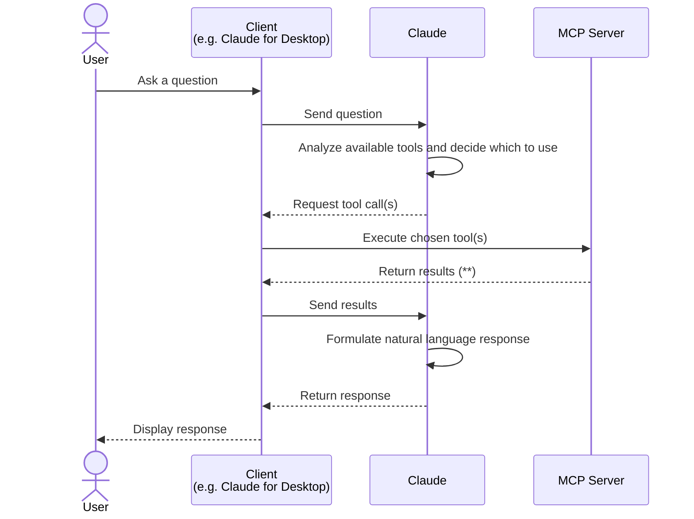

# Demo MCP Server setup

Mainly following the official tutorial from Anthropic:
[Build an MCP server](https://modelcontextprotocol.io/docs/2026-07-28/develop/build-server) (*)

## (*) Implementation Notes:

You may have to do three things differently from what the official docs describe:

### 1️⃣ Path to `claude_desktop_config.json`

After building & running the MCP server, when you're about to test it with Claude Desktop, the tutorial specifies the need to create and edit a config file `claude_desktop_config.json` ([Testing your server with Claude for Desktop](https://modelcontextprotocol.io/docs/2026-07-28/develop/build-server#testing-your-server-with-claude-for-desktop)) at `AppData\Claude\claude_desktop_config.json`. 

This would be the step that allows your Client, i.e. Claude for Desktop in this case, to know about the MCP server you just built.

But the path mentioned in the Anthropic docs may be incompatible with the actual Claude Desktop installation on your MradServices PC. 

**How to open the file automatically on your system:**

1. Open the **Claude for Desktop** app.
1. Go to the system tray menu and open **Settings**.
1. Click on the *Developer* tab on the left sidebar.
1. Click the **Edit Config** button to open or create the file automatically.

Then add the `mcpServers` schema to the file, save the changes, and restart **Claude for Desktop**.

You can then pick up with the instructions from the official tutorial at this step: [Test with commands](https://modelcontextprotocol.io/docs/2026-07-28/develop/build-server#test-with-commands)

### 2️⃣ Path to mcp logs

For troubleshooting MCP Server testing, the Anthropic docs mention incompatible paths at this step again ([Getting logs from Claude for Desktop](https://modelcontextprotocol.io/docs/2026-07-28/develop/build-server#troubleshooting)). 

Actually, on your PC, you may find the files under:

- "C:\Users\\<your-windows-username\>\AppData\Local\Claude\logs\mcp.log"
- "C:\Users\\<your-windows-username\>\AppData\Local\Claude\logs\mcp-server-weather.log"

### 3️⃣ Optional: Preventing false positives

After successfully activating the weather MCP server connector in Claude for Desktop, the official docs recommend to test it just by asking: **"What's the weather in X?"**.

But Claude might just use its built-in weather-tool to process this prompt, instead of the weather server you built. 

To ensure the server is used, simply add this instruction to the prompt: **"Use the 'weather' connector"**.
(Usually, Claude will remember this preference and you just have to specify it once)

You'll know Claude used the MCP Server if you see the actual tool call and the request/response schemas:

## How the process (roughly) works at a glance

(**) Results always pass through the client, since Claude has no direct connection to the MCP server
